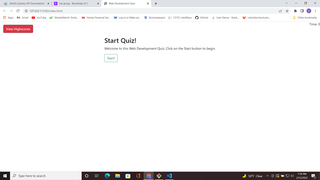
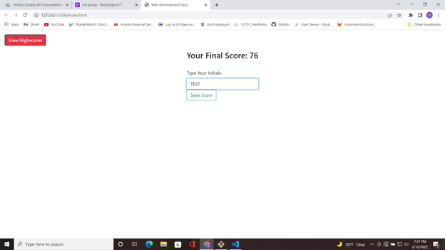
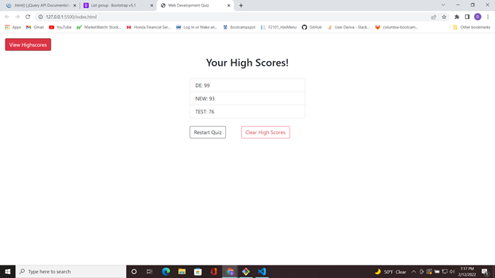

# Web-Dev-Quiz 
  ## Description 

  This is a simple coding quiz that references different tenants of JavaScript. Like all web development professionals I have and will have to take more coding quizes. It is a good way to enhance knowledge, as well as test a prospective job applicant. In writing this coding quiz I have learned more about HTML, CSS, and JavaScript, particularly the DOM manipulation portion of it. This exercise has shown me a good way to keep sharp and grow my expertise in coding.

  ## *Installation*

  You can install the app project files from my github repo containing the code files. It doesnt have a live server page so just install and open it up from the `index.html` file. 

  ## Usage 
  
  The app is being hosted on GitHub at a live pages site. The link is located below.

  ## Screenshots/Links

  
  
  

  - Link to page: [Web-Dev-Quiz](https://demsley1.github.io/Web-Dev-Quiz/)

  ## Questions 

  - My GitHub username: Demsley1
  - Link to my GitHub page and repositories: [Github Link](https://github.com/Demsley1)
  _Link to my main work email if anyone should ever choose to contact me regarding work, or with helpful suggestions on how to improve this project and 
  also fix or update any major issues with project_
  - For All inquires email me at: emsley3684@gmail.com
